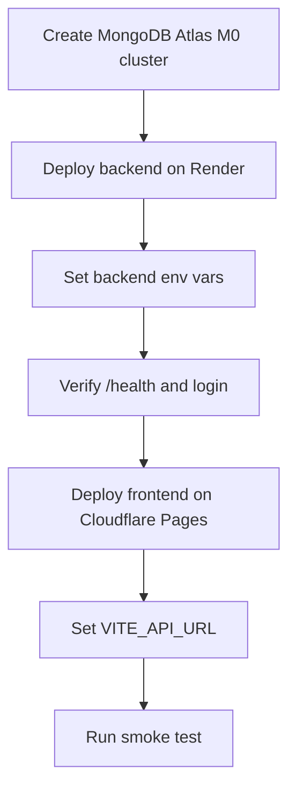
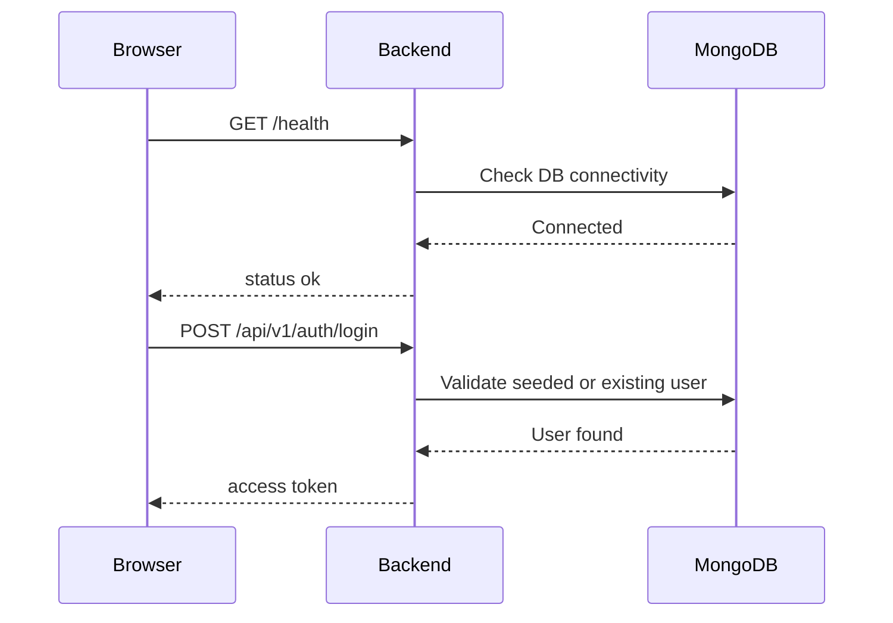

# DevLedger Free Deployment Checklist

Last updated: April 1, 2026

This file is the shortest path from the current repository state to a working free deployment.

## Deployment Goal

Deploy DevLedger using only free services:

- Frontend: Cloudflare Pages
- Backend: Render Free Web Service
- Database: MongoDB Atlas M0

## Why This Stack

- Cloudflare Pages works well for the Vite frontend and expects `npm run build` with a `dist` output directory.
- Render Free Web Services can host the backend, but they spin down after 15 minutes of inactivity and can take about one minute to wake up.
- MongoDB Atlas M0 is still free and sufficient for a portfolio MVP.

## Current Project State

### Already done in the repo

- frontend scaffolding is complete
- frontend production build works
- backend runtime deployment path is set up through `tsx`
- documentation exists in `docs/`
- demo mode exists for portfolio-safe frontend hosting

### Still requires your accounts/secrets

- MongoDB Atlas cluster creation
- Render service creation
- Cloudflare Pages project creation
- production environment variables

## Deployment Flow



## Step 1: Create MongoDB Atlas

### Action

Create one free Atlas cluster and copy the connection string.

### Save these values

- `MONGODB_URI`
- Atlas database username
- Atlas database password

### Target connection string format

```env
MONGODB_URI=mongodb+srv://<username>:<password>@<cluster>.mongodb.net/devledger?retryWrites=true&w=majority
```

### Checklist

- [ ] Atlas account created
- [ ] M0 cluster created
- [ ] database user created
- [ ] network access configured
- [ ] connection string copied

## Step 2: Deploy Backend on Render

### Service type

Web Service

### Repository settings

- Root Directory: `backend`
- Build Command: `npm install && npm run build`
- Start Command: `npm start`
- Node Version: `22`

### Backend environment variables

Set these in Render:

```env
NODE_ENV=production
PORT=3000
HOST=0.0.0.0
MONGODB_URI=<your-atlas-uri>
JWT_SECRET=<random-secret-at-least-32-characters>
JWT_ACCESS_EXPIRY=15m
JWT_REFRESH_EXPIRY=7d
FRONTEND_URL=https://<your-cloudflare-pages-domain>
```

### Notes

- The backend currently runs via `tsx src/server.ts` in production.
- This is okay for the current MVP and unblocks deployment now.
- Do not use Node 25 on Render for this project. Pin the service to Node 22.
- Render Free spins down on idle, so the first request after inactivity will be slow.
- Render Free blocks outbound SMTP ports, so email automation should not be part of this free deployment plan.

### Checklist

- [ ] Render account created
- [ ] backend service created
- [ ] root directory set to `backend`
- [ ] build command entered
- [ ] start command entered
- [ ] env vars added
- [ ] first deploy passed

## Step 3: Verify Backend

After Render deploys, test:

- `GET https://<backend-domain>/health`
- login endpoint
- one authenticated route

### Smoke test sequence



### Checklist

- [ ] `/health` returns `status: ok`
- [ ] backend reports database connected
- [ ] login works
- [ ] at least one protected route works

## Step 4: Deploy Frontend on Cloudflare Pages

### Project settings

- Root Directory: `frontend`
- Build Command: `npm install && npm run build`
- Build Output Directory: `dist`

### Frontend environment variables

```env
VITE_API_URL=https://<your-render-backend-domain>/api/v1
```

### Notes

- The frontend uses hash routing, so static hosting is simple.
- Demo mode remains available even if the backend is sleeping.

### Checklist

- [ ] Cloudflare account created
- [ ] Pages project created
- [ ] root directory set to `frontend`
- [ ] build command entered
- [ ] output directory set to `dist`
- [ ] `VITE_API_URL` added
- [ ] frontend deploy passed

## Step 5: Final End-to-End Test

### Test path

1. open the frontend URL
2. confirm login page loads
3. try demo mode
4. try live login
5. load dashboard, projects, and tasks

### Checklist

- [ ] frontend loads
- [ ] demo mode works
- [ ] live mode works
- [ ] dashboard loads
- [ ] projects page loads
- [ ] tasks page loads

## If Something Breaks

### Frontend works, API fails

Check:

- `VITE_API_URL`
- Render service health
- `FRONTEND_URL` on backend
- backend env vars

### Backend health fails

Check:

- `MONGODB_URI`
- Atlas network access
- Atlas credentials
- Render deploy logs

### Login fails

Check:

- database seeding
- JWT secret
- backend logs

## Suggested Order of Work Today

Follow this exact order:

1. Create Atlas cluster
2. Create Render backend service
3. Verify `/health`
4. Seed database if needed
5. Create Cloudflare Pages frontend
6. Set `VITE_API_URL`
7. Test live login

## What To Send Back To Me

If you want me to keep guiding you live, send me:

- your Render service URL
- your Cloudflare Pages URL
- whether Atlas is created
- any error text from `/health` or login

Once you send those, I can help you finish the remaining steps fast.
