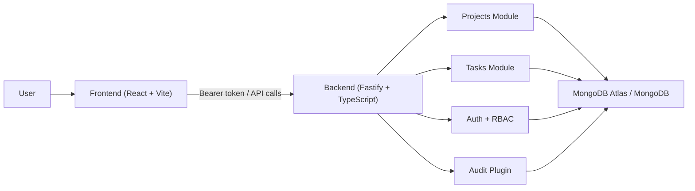

# DevLedger Documentation

This directory is the source of truth for operating, deploying, and explaining DevLedger.

## Document Map

- [Deployment Runbook](./runbooks/deployment.md)
  Full step-by-step guide for local setup, free hosting deployment, environment variables, smoke tests, and rollback.
- [Production Readiness Guide](./runbooks/production-readiness.md)
  Release checklist, hardening guidance, known gaps, and production operating standards.
- [Feature Reference](./product/features.md)
  Feature-by-feature explanation of authentication, RBAC, projects, tasks, dashboard behavior, and audit logging.
- [Workflow Guide](./product/workflows.md)
  End-to-end user and system workflows with Mermaid diagrams for auth, project delivery, and deployment flows.

## Recommended Reading Order

1. Read the [Feature Reference](./product/features.md) to understand what the product does.
2. Read the [Workflow Guide](./product/workflows.md) to understand how users move through the system.
3. Use the [Deployment Runbook](./runbooks/deployment.md) when you want to run or ship the project.
4. Review the [Production Readiness Guide](./runbooks/production-readiness.md) before any public release.

## Current Project Position

DevLedger is now in a portfolio-ready MVP state:

- Frontend build is working and deployable.
- Backend runtime is deployable with `tsx`.
- Core modules exist for auth, RBAC, users, projects, tasks, and audit logging.
- Some backend strict TypeScript cleanup is still pending before calling the API fully production-hardened.

## High-Level System View

