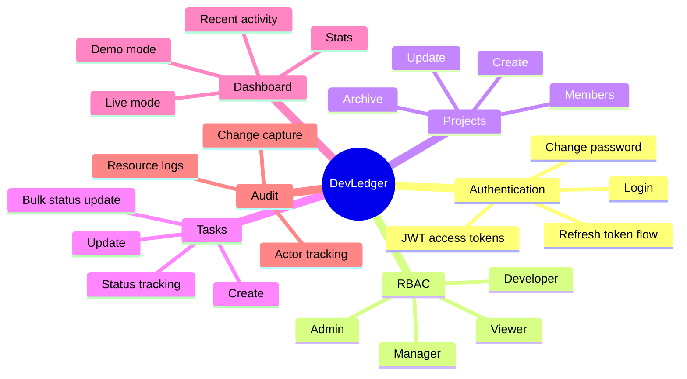

# Feature Reference

This document explains what DevLedger does today and how each module is intended to behave.

## Product Goal

DevLedger is a project management system focused on:

- role-based access control
- task and project visibility
- team-oriented delivery tracking
- auditability
- portfolio-ready presentation

## Feature Map

## Authentication

### What it includes

- registration
- login
- access tokens
- refresh token flow
- logout
- current user lookup
- password change

### Why it matters

Authentication establishes the active user identity that every RBAC decision depends on.

### Current implementation notes

- access tokens are returned to the frontend
- refresh tokens are designed to live in cookies
- login rate limiting is already present in route configuration

## Role-Based Access Control

### Roles

- `ADMIN`
- `MANAGER`
- `DEVELOPER`
- `VIEWER`

### Intent

Each role is meant to restrict what the user can read, create, update, or delete across users, projects, and tasks.

### Enforcement model

RBAC decisions happen through:

- JWT identity
- role data in the token
- route guards
- service-layer access checks

## Users Module

### Core capabilities

- view current user
- update own profile
- list users
- create users
- update users
- deactivate users

### Intended access shape

- authenticated users can view and update their own profile
- managers and admins can list users
- admins can create, update, and deactivate other users

## Projects Module

### Core capabilities

- create project
- list accessible projects
- get project details
- update project
- add members
- remove members
- archive project
- dashboard project stats

### Business rules

- owners and elevated roles control project changes
- members gain project visibility
- regular users should only see projects they own or belong to

## Tasks Module

### Core capabilities

- create task
- list tasks
- get current user's tasks
- get task details
- update task
- update task status quickly
- bulk update statuses
- delete task
- dashboard task stats

### Business rules

- tasks belong to projects
- assignees should be valid project members
- owners, creators, assignees, and elevated roles have different update rights

## Audit Logging

### Goal

The audit layer is intended to capture:

- who performed the action
- what changed
- which resource changed
- when it changed
- old and new values when available

### Why it matters

This is one of the strongest "serious engineering" signals in the project, especially for interviews and resume discussion.

## Frontend Experience

### Live mode

When a valid token exists, the UI attempts to load:

- current user
- projects
- tasks
- dashboard summaries

### Demo mode

When no session is available, the UI uses curated demo data so the app remains deployable and presentable.

### Why demo mode matters

Demo mode makes the project useful even when:

- backend env vars are not configured
- the API is asleep on a free tier
- MongoDB is not available during a walkthrough

## Feature Status Matrix

| Feature | Status | Notes |
|---|---|---|
| Frontend dashboard shell | Implemented | Build verified |
| Demo mode | Implemented | Portfolio-safe |
| Live API wiring | Implemented | Depends on backend env and valid session |
| Auth routes | Implemented | Needs deeper production verification |
| RBAC guards | Implemented | Strong architecture signal |
| Users module | Implemented | Some backend typing polish still pending |
| Projects module | Implemented | Core CRUD and membership logic present |
| Tasks module | Implemented | Core CRUD and status flow present |
| Audit logging | Implemented | Good architectural feature |
| Email summary automation | Not implemented | Do not claim as shipped yet |

## Resume-Safe Talking Points

You can confidently say the project includes:

- RBAC architecture
- JWT-based auth flow
- MongoDB schema/index design
- Fastify backend modularization
- task/project management domain logic
- portfolio-ready frontend deployment

You should not currently say it includes:

- completed email reporting automation
- full production hardening
- comprehensive automated test coverage
