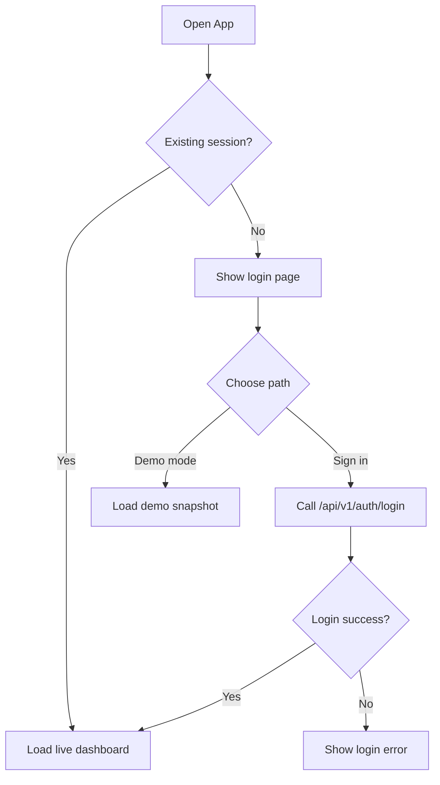
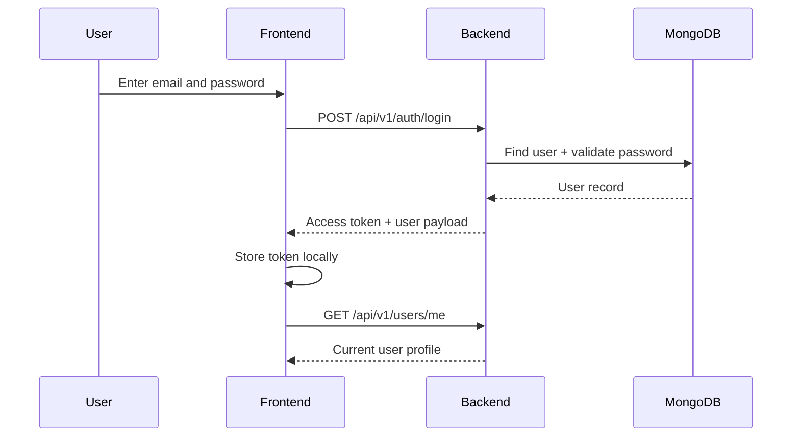
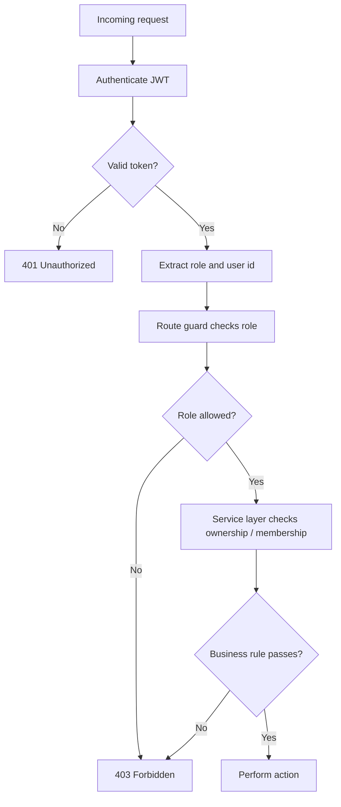
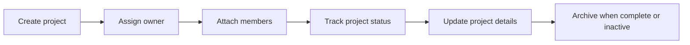
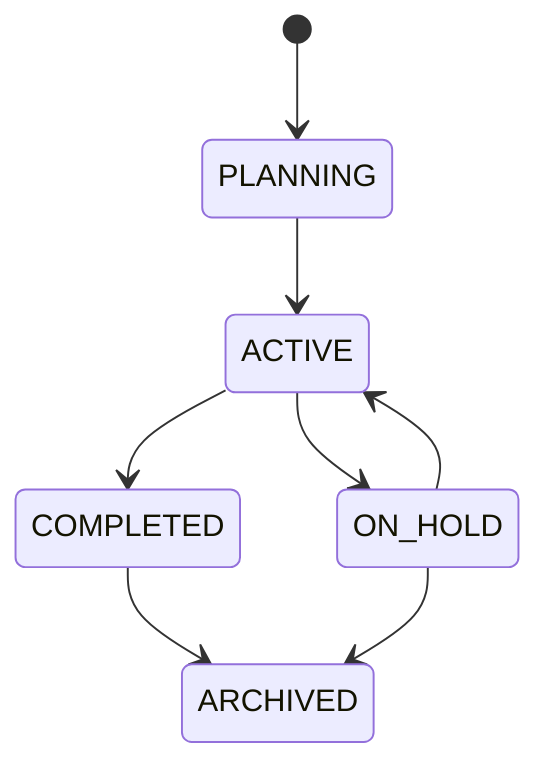
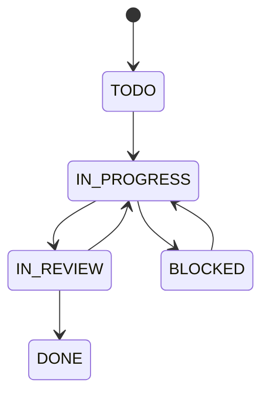
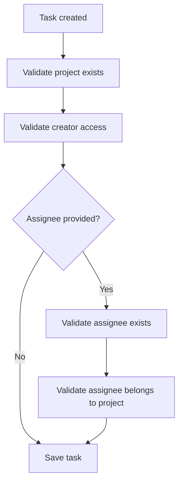
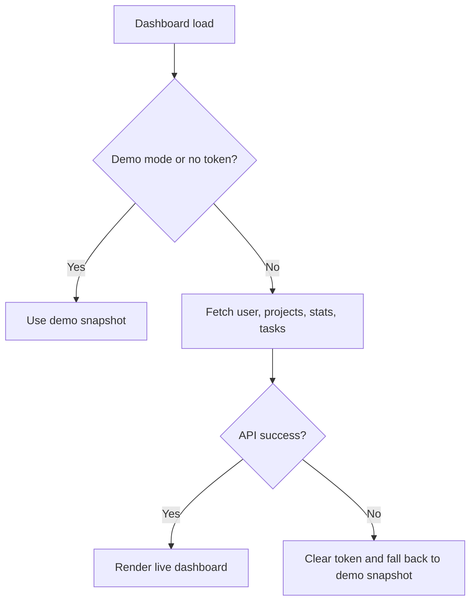
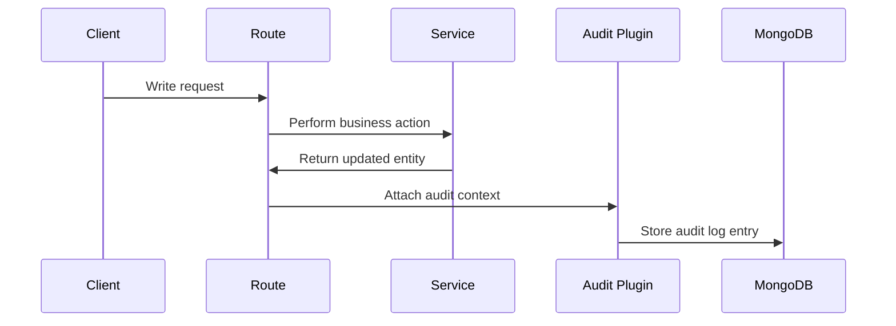
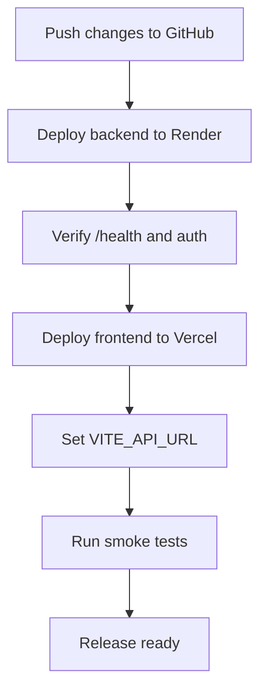

# Workflow Guide

This guide explains how users and the system move through the major DevLedger workflows.

## 1. Access Workflow

Users enter through either a live session or demo mode.

## 2. Authentication Workflow

## 3. RBAC Decision Workflow

## 4. Project Management Workflow

### Project status lifecycle

## 5. Task Delivery Workflow

### Task ownership workflow

## 6. Dashboard Data Workflow

The dashboard can render from two sources.

## 7. Audit Logging Workflow

## 8. Deployment Workflow

## Workflow Notes

- Demo mode is intentional, not a fallback accident.
- Live mode depends on a valid token and reachable backend.
- RBAC is enforced at both route and service levels.
- Projects and tasks are the core business workflows.
- Audit logging is a supporting workflow that records sensitive actions.
