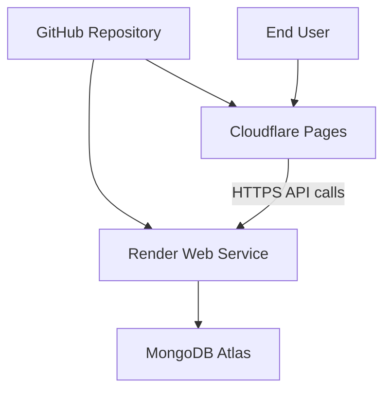
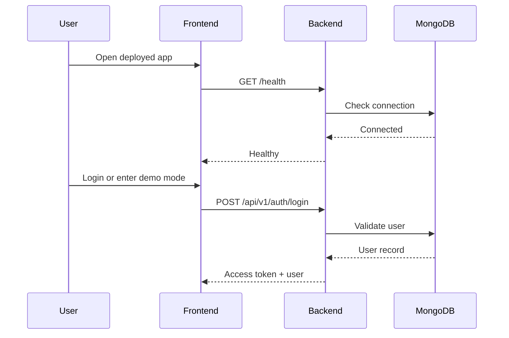

# Deployment Runbook

This runbook explains how to run DevLedger locally and how to deploy it on a free stack.

## Scope

This guide covers:

- local development
- MongoDB setup
- backend deployment
- frontend deployment
- environment variables
- smoke testing
- rollback guidance

## Recommended Free Stack

- Frontend: Cloudflare Pages
- Backend: Render Web Service
- Database: MongoDB Atlas free tier

This split works well because the frontend is a static build and the backend only needs a Node runtime plus MongoDB connectivity.

## Repository Layout

```text
devledger/
├── backend/
├── frontend/
└── docs/
```

## Deployment Architecture



## Prerequisites

- Node.js 20 or newer
- npm
- MongoDB Atlas account or local MongoDB
- GitHub repo access
- Render account
- Cloudflare account

## Environment Variables

### Backend

Create `backend/.env` from `backend/.env.example`.

Required variables:

- `NODE_ENV`
- `PORT`
- `HOST`
- `MONGODB_URI`
- `JWT_SECRET`
- `JWT_ACCESS_EXPIRY`
- `JWT_REFRESH_EXPIRY`
- `FRONTEND_URL`

Recommended production values:

```env
NODE_ENV=production
PORT=3000
HOST=0.0.0.0
MONGODB_URI=mongodb+srv://<username>:<password>@<cluster>.mongodb.net/devledger?retryWrites=true&w=majority
JWT_SECRET=<long-random-secret-at-least-32-characters>
JWT_ACCESS_EXPIRY=15m
JWT_REFRESH_EXPIRY=7d
FRONTEND_URL=https://<your-frontend-domain>
```

### Frontend

Create `frontend/.env` from `frontend/.env.example`.

Required variable:

- `VITE_API_URL`

Example:

```env
VITE_API_URL=https://<your-render-service>.onrender.com/api/v1
```

## Local Development Runbook

### 1. Install backend dependencies

```bash
cd backend
npm install
```

### 2. Install frontend dependencies

```bash
cd ../frontend
npm install
```

### 3. Configure backend env

```bash
cd ../backend
cp .env.example .env
```

Edit `.env` and set:

- `MONGODB_URI`
- `JWT_SECRET`
- `FRONTEND_URL=http://localhost:5173`

### 4. Configure frontend env

```bash
cd ../frontend
cp .env.example .env
```

Set:

```env
VITE_API_URL=http://localhost:3000/api/v1
```

### 5. Start backend

```bash
cd ../backend
npm run dev
```

### 6. Start frontend

```bash
cd ../frontend
npm run dev
```

### 7. Optional database seed

If your MongoDB connection is valid and you want sample accounts:

```bash
cd ../backend
npm run db:seed
```

## Local Verification Checklist

- Open `http://localhost:5173`
- Confirm the login page loads
- Try demo mode
- If seeded data exists, log in with the admin account
- Check `http://localhost:3000/health`

## Backend Deployment Runbook

### Render Service Settings

- Root directory: `backend`
- Build command: `npm install && npm run build`
- Start command: `npm start`

### Backend Runtime Notes

DevLedger currently deploys the backend by running `tsx src/server.ts` through `npm start`.

This is acceptable for the current MVP because:

- it avoids blocking deployment on unfinished strict TypeScript cleanup
- it keeps the runtime simple
- it preserves the current source structure

Future hardening should restore a compiled `dist/` runtime.

### Backend Deployment Steps

1. Push the repository to GitHub.
2. Create a new Render Web Service.
3. Point it to the repository.
4. Set the root directory to `backend`.
5. Add the backend environment variables.
6. Deploy the service.

### Backend Smoke Tests

After deployment:

- `GET /health`
- `POST /api/v1/auth/login`
- `GET /api/v1/users/me` with a bearer token
- `GET /api/v1/projects`
- `GET /api/v1/tasks`

## Frontend Deployment Runbook

### Cloudflare Pages Settings

- Root directory: `frontend`
- Build command: `npm install && npm run build`
- Build output directory: `dist`

### Frontend Deployment Steps

1. Create a new Cloudflare Pages project.
2. Connect the GitHub repository.
3. Set the root directory to `frontend`.
4. Add `VITE_API_URL` as a Pages environment variable.
5. Trigger the build.
6. Open the deployed site and confirm the login screen loads.

## Deployment Sequence

Deploy in this order:

1. MongoDB Atlas
2. Backend
3. Frontend

This order matters because the frontend needs the backend URL, and the backend needs a live database.

## Post-Deployment Smoke Test



## Rollback Runbook

If a deployment is unhealthy:

1. Keep the database unchanged unless there is a proven migration issue.
2. Roll the frontend back to the previous successful Pages deployment.
3. Roll the backend back to the previous Render deployment.
4. Re-run smoke tests.
5. Inspect:
   - backend env vars
   - `FRONTEND_URL`
   - `VITE_API_URL`
   - MongoDB network access

## Common Failure Modes

### Frontend loads but API calls fail

Check:

- `VITE_API_URL`
- CORS `FRONTEND_URL`
- Render service health

### Login fails for seeded accounts

Check:

- database seeding completed
- `JWT_SECRET` is set
- backend can read MongoDB

### Demo mode works but live mode fails

This usually means the frontend is healthy and the backend or environment configuration is the failing part.

## Release Checklist

- frontend `npm run build`
- backend `npm install`
- backend `npm run build`
- backend env vars configured
- frontend env vars configured
- seeded credentials tested or demo mode validated
- `/health` endpoint reachable
