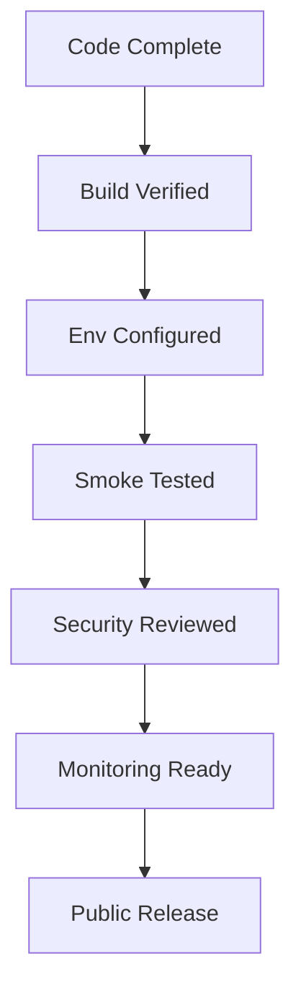

# Production Readiness Guide

This guide defines what "production ready" means for DevLedger and what still needs to be tightened before a public release.

## Current Status Summary

| Area | Status | Notes |
|---|---|---|
| Frontend build pipeline | Ready | Static production build succeeds |
| Frontend UX for portfolio/demo | Ready | Demo mode and live mode both exist |
| Backend runtime deployment | Ready with caveat | Runs through `tsx` instead of compiled `dist` |
| Auth and RBAC design | Strong | Core structure is present |
| Database models and indexes | Strong | Schemas and indexes exist |
| Automated tests | Weak | Minimal effective coverage today |
| Observability | Partial | Logging exists, but alerting is not formalized |
| Secret management | Ready if hosted correctly | Must be configured in hosting provider |
| Type safety cleanup | Partial | Strict backend TypeScript cleanup still pending |

## Readiness Model

## Minimum Production Gate

Before calling DevLedger production-ready, all of the following should be true:

- frontend build is green
- backend runtime starts successfully in hosted environment
- MongoDB Atlas connection is stable
- auth login works with seeded or real accounts
- CORS is locked to the deployed frontend domain
- secrets are stored only in the hosting platform
- smoke tests pass
- rollback path is known

## Security Checklist

### Already present

- JWT-based authentication
- refresh token workflow design
- RBAC guard layer
- MongoDB schema validation
- rate limiting
- helmet and cors usage

### Still recommended before public release

- verify refresh token rotation against real login/refresh/logout flows
- add brute-force monitoring around login failures
- rotate `JWT_SECRET` if it was ever shared in test environments
- ensure all seeded demo accounts are removed or isolated in production
- review audit log retention and access policy

## Infrastructure Checklist

- MongoDB Atlas network access restricted appropriately
- Render environment variables set correctly
- frontend `VITE_API_URL` points to the real backend
- `FRONTEND_URL` matches the real deployed frontend domain
- custom domains configured only after smoke tests pass

## Operational Checklist

- owner knows how to redeploy frontend
- owner knows how to redeploy backend
- owner knows how to rotate JWT secret
- owner knows how to reseed non-production data
- owner knows how to check `/health`

## Release Candidate Checklist

### Frontend

- `npm install`
- `npm run build`
- login page loads
- demo mode works
- live mode works against deployed backend
- mobile navigation is usable

### Backend

- `npm install`
- `npm run build`
- `npm start`
- `/health` returns healthy
- login endpoint works
- users, projects, and tasks endpoints respond as expected

## Recommended Hardening Backlog

### High priority

- restore compiled backend runtime instead of runtime `tsx`
- add route-level tests for auth, users, projects, and tasks
- add integration tests against MongoDB
- verify refresh token cookie behavior in production

### Medium priority

- add centralized request/response logging policy
- add dashboards or uptime monitoring
- add structured error reporting
- add migration or seed version tracking

### Nice to have

- role/permission matrix documentation at endpoint level
- CI workflow for lint/build/test
- preview environments per branch

## Known Caveats

- The backend is deployable, but not yet fully cleaned up under strict TypeScript compilation.
- The repo does not yet prove every resume bullet through automated tests.
- Email automation is not implemented in the current codebase and should not be presented as shipped.

## Production Decision Matrix

| Scenario | Recommendation |
|---|---|
| Portfolio demo | Safe now |
| Recruiter showcase | Safe now |
| Internal pilot with a few users | Acceptable with env discipline |
| Public multi-tenant SaaS launch | Not yet |

## Final Recommendation

DevLedger is ready for:

- portfolio deployment
- resume-backed demonstrations
- recruiter walkthroughs
- controlled MVP hosting

DevLedger is not yet ready for:

- high-traffic public launch
- compliance-heavy environments
- claims of full production hardening
